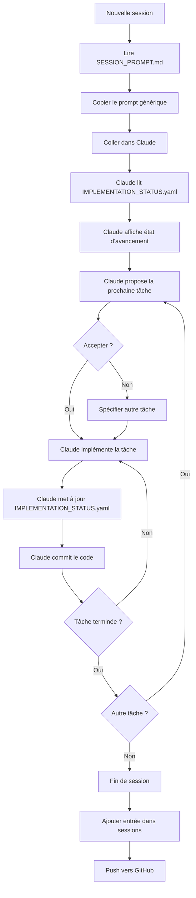

# Documentation - Bibliothèque de Minéraux de Référence

## 📚 Vue d'ensemble

Ce dossier contient la documentation complète pour l'implémentation de la fonctionnalité **"Bibliothèque de Minéraux de Référence"** dans MineraLog.

## 📁 Structure des fichiers

### 1. `ROADMAP_REFERENCE_LIBRARY.md`
**Roadmap détaillée du projet**

- **Rôle :** Document de référence principal décrivant toutes les phases d'implémentation
- **Contenu :**
  - Vue d'ensemble du projet et objectifs
  - 8 phases d'implémentation détaillées (Phases 1-8)
  - Tâches et sous-tâches pour chaque phase
  - Dépendances entre phases
  - Critères de validation
  - Métriques de succès
  - Gestion des risques
- **Usage :** Lecture pour comprendre QUOI implémenter et COMMENT
- **Mis à jour :** Rarement (seulement si changement majeur de scope)

### 2. `IMPLEMENTATION_STATUS.yaml`
**Suivi temps réel de l'avancement**

- **Rôle :** Fichier de tracking de l'état d'avancement de chaque tâche
- **Contenu :**
  - État de chaque phase (not_started / in_progress / completed / blocked)
  - Pourcentage de progression par tâche et sous-tâche
  - Dates de début/fin
  - Notes et observations
  - Historique des sessions de travail
- **Usage :** Mise à jour CONSTANTE au fur et à mesure de l'implémentation
- **Format :** YAML (facilement parsable et éditable)
- **Mis à jour :** À chaque session de travail

### 3. `SESSION_PROMPT.md`
**Prompt générique pour chaque session**

- **Rôle :** Template de prompt à utiliser au début de chaque session de travail
- **Contenu :**
  - Prompt principal à copier-coller
  - Variantes selon le besoin (démarrage phase, continuation, tâche spécifique, etc.)
  - Format attendu du rapport d'avancement
  - Processus de mise à jour du status
  - Convention de commits
  - Checklist de fin de session
- **Usage :** Copier le prompt au début de chaque session avec Claude
- **Mis à jour :** Rarement (évolution du processus)

### 4. `README_REFERENCE_LIBRARY.md` (ce fichier)
**Guide d'utilisation de la documentation**

- **Rôle :** Expliquer comment utiliser tous ces documents
- **Contenu :** Vous êtes ici 😊

---

## 🚀 Comment utiliser cette documentation

### Scénario 1 : Première découverte du projet

1. **Lire** `ROADMAP_REFERENCE_LIBRARY.md` en entier
   - Comprendre la vision globale
   - Identifier les phases et leurs dépendances
   - Noter les métriques de succès

2. **Consulter** `IMPLEMENTATION_STATUS.yaml`
   - Vérifier l'état actuel (toutes les phases à "not_started" au début)
   - Confirmer que tout est prêt

3. **Préparer** la première session avec `SESSION_PROMPT.md`
   - Copier le prompt de "Démarrage d'une nouvelle phase"
   - Commencer par la Phase 1

### Scénario 2 : Démarrage d'une session de travail

1. **Ouvrir** `SESSION_PROMPT.md`
2. **Copier** le prompt générique (ou une variante selon le besoin)
3. **Coller** dans une nouvelle conversation avec Claude
4. **Claude va automatiquement :**
   - Lire `IMPLEMENTATION_STATUS.yaml`
   - Afficher l'état d'avancement
   - Identifier la prochaine tâche à traiter
   - Continuer l'implémentation

### Scénario 3 : Pendant l'implémentation

- **Claude met à jour** `IMPLEMENTATION_STATUS.yaml` au fur et à mesure :
  - Marque les sous-tâches comme `done: true`
  - Met à jour les pourcentages de progression
  - Change les status (not_started → in_progress → completed)

- **Vous** :
  - Vérifiez régulièrement les commits
  - Testez le code produit
  - Validez que tout fonctionne

### Scénario 4 : Fin de session

1. **Vérifier** la checklist de fin de session (`SESSION_PROMPT.md`)
2. **S'assurer que** `IMPLEMENTATION_STATUS.yaml` est à jour
3. **Ajouter** une entrée dans `sessions[]` avec notes de la session
4. **Commit & Push** tous les changements

### Scénario 5 : Vérifier l'avancement global

**Utiliser le prompt "Résumé d'avancement uniquement"** :
```
Affiche-moi un résumé de l'état d'avancement de la roadmap "Bibliothèque de Minéraux de Référence".
```

Claude va lire `IMPLEMENTATION_STATUS.yaml` et afficher :
- Progression globale (%)
- État de chaque phase
- Prochaine action recommandée

---

## 🎯 Workflow recommandé



---

## 📊 Suivi de l'avancement

### Indicateurs clés

**Dans `IMPLEMENTATION_STATUS.yaml` :**
- `overall_progress` : Pourcentage global du projet (0-100)
- `phase_X.progress` : Pourcentage de chaque phase (0-100)
- `phase_X.status` : État de la phase
  - `not_started` : Pas encore commencée
  - `in_progress` : En cours de réalisation
  - `completed` : Terminée et validée
  - `blocked` : Bloquée (voir `blockers[]`)

### Calcul de la progression

**Progression d'une tâche :**
```
progress = (nombre de subtasks done / nombre total de subtasks) × 100
```

**Progression d'une phase :**
```
progress = moyenne des progress de toutes les tâches de la phase
```

**Progression globale du projet :**
```
overall_progress = moyenne pondérée des progress de toutes les phases
(phases critiques ont un poids plus élevé)
```

---

## 🔧 Maintenance des fichiers

### Quand mettre à jour `ROADMAP_REFERENCE_LIBRARY.md` ?

- ✅ **OUI** si :
  - Changement majeur de scope (ajout/suppression d'une phase)
  - Nouvelle exigence métier
  - Découverte d'une contrainte technique majeure
  - Révision des critères de validation

- ❌ **NON** pour :
  - Modifications mineures d'implémentation
  - Changements de code
  - Bugs découverts en cours de route

### Quand mettre à jour `IMPLEMENTATION_STATUS.yaml` ?

- ✅ **TOUJOURS** :
  - À chaque sous-tâche complétée
  - À chaque changement de status
  - À la fin de chaque session (entrée dans `sessions[]`)
  - En cas de blocage (ajouter dans `blockers[]`)

### Quand mettre à jour `SESSION_PROMPT.md` ?

- ✅ **OUI** si :
  - Amélioration du processus de travail
  - Nouvelle variante de prompt utile
  - Changement de convention (commits, nommage, etc.)

- ❌ **NON** pour :
  - Contenu spécifique à une tâche (ça va dans ROADMAP)
  - État d'avancement (ça va dans STATUS)

---

## 🧪 Tests et validation

### Critères de validation par phase

Chaque phase dans `ROADMAP_REFERENCE_LIBRARY.md` a une section **"Critères de validation"**.

**Exemple (Phase 1) :**
- ✅ Migration DB v5→v6 réussie sans perte de données
- ✅ 50+ minéraux pré-populés après migration
- ✅ Tous les tests unitaires passent
- ✅ Pas de régression sur les fonctionnalités existantes

**Processus :**
1. Implémenter toutes les tâches de la phase
2. Vérifier tous les critères de validation
3. Si tous validés → marquer la phase comme `completed`
4. Sinon → rester en `in_progress` et corriger

---

## 📝 Convention de commits

**Format obligatoire :**
```
<type>(reference-library): [Phase X.Y] <description>

<body optionnel>

Refs: docs/IMPLEMENTATION_STATUS.yaml
```

**Types :**
- `feat` : Nouvelle fonctionnalité
- `fix` : Correction de bug
- `refactor` : Refactoring
- `test` : Ajout de tests
- `docs` : Documentation
- `chore` : Maintenance

**Exemples :**
```bash
git commit -m "feat(reference-library): [Phase 1.1] Create ReferenceMineralEntity

- Added all entity fields with Room annotations
- Added indices for optimized queries

Refs: docs/IMPLEMENTATION_STATUS.yaml (phase_1.tasks.1_1_entity: completed)"
```

---

## 🆘 Résolution de problèmes

### Problème : "Je ne sais pas par où commencer"

**Solution :**
1. Lire `IMPLEMENTATION_STATUS.yaml` → vérifier `current_phase`
2. Lire `ROADMAP_REFERENCE_LIBRARY.md` → section de cette phase
3. Utiliser le prompt "Démarrage d'une nouvelle phase" de `SESSION_PROMPT.md`

### Problème : "Une phase est bloquée"

**Solution :**
1. Mettre à jour `IMPLEMENTATION_STATUS.yaml` :
   ```yaml
   phase_X:
     status: "blocked"
     blockers:
       - "Description du problème"
   ```
2. Documenter dans `notes[]`
3. Passer à une phase non dépendante si possible
4. Consulter la section "Risques et mitigation" de la roadmap

### Problème : "Les tests échouent"

**Solution :**
1. NE PAS marquer la tâche comme complétée
2. Ajouter une note de session dans `IMPLEMENTATION_STATUS.yaml`
3. Fixer les tests avant de continuer
4. Si besoin, revenir sur les étapes précédentes

### Problème : "Divergence avec le code existant"

**Solution :**
1. Analyser l'impact
2. Proposer un refactoring si nécessaire
3. Documenter dans `notes[]` de `IMPLEMENTATION_STATUS.yaml`
4. Si changement majeur : mettre à jour `ROADMAP_REFERENCE_LIBRARY.md`

---

## 📞 Contact et support

- **Repo GitHub :** VBlackJack/MineraLog
- **Branche de travail :** `claude/mineral-reference-library-01QesBzGZhi24Mep1j3a9xRJ`
- **Documentation :** `docs/` (ce dossier)

---

## 🎓 Ressources complémentaires

### Liens vers la documentation principale

- [ROADMAP_REFERENCE_LIBRARY.md](./ROADMAP_REFERENCE_LIBRARY.md) - Roadmap complète
- [IMPLEMENTATION_STATUS.yaml](./IMPLEMENTATION_STATUS.yaml) - Suivi d'avancement
- [SESSION_PROMPT.md](./SESSION_PROMPT.md) - Prompts de session

### Documentation technique MineraLog

- Architecture globale : (à ajouter)
- Guide de contribution : (à ajouter)
- Tests : (à ajouter)

---

**Version de ce README :** 1.0
**Date de création :** 2025-01-16
**Dernière mise à jour :** 2025-01-16

---

## 🎉 Prêt à commencer !

Vous avez maintenant tous les outils pour implémenter efficacement la bibliothèque de minéraux de référence.

**Prochaine étape recommandée :**
1. Lire `ROADMAP_REFERENCE_LIBRARY.md` (si pas encore fait)
2. Ouvrir `SESSION_PROMPT.md`
3. Copier le prompt "Démarrage d'une nouvelle phase"
4. Lancer une session avec Claude
5. Commencer la Phase 1 🚀

**Bon développement !**
