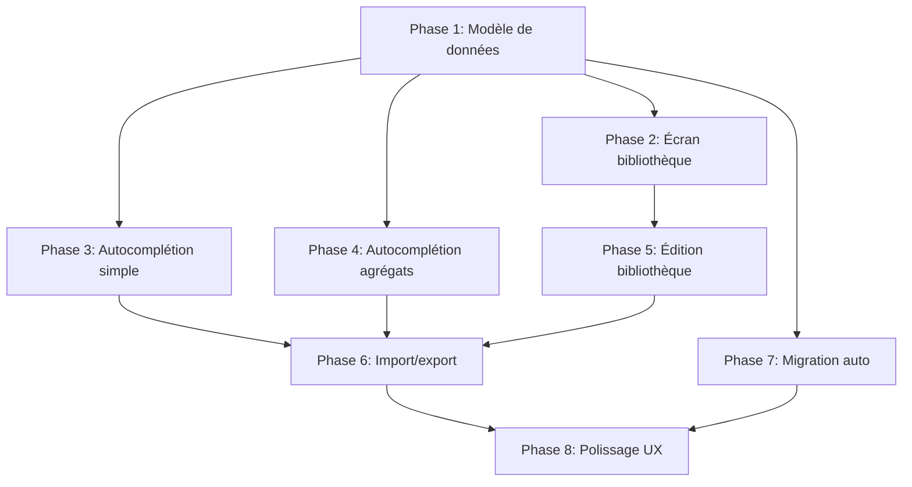

# Roadmap : Bibliothèque de Minéraux de Référence

> **Version :** 1.0
> **Date de création :** 2025-01-16
> **Objectif :** Introduire une bibliothèque de minéraux de référence pour réduire drastiquement le temps de saisie des spécimens et agrégats

---

## Vue d'ensemble

Cette roadmap détaille l'implémentation d'une **bibliothèque de minéraux de référence** embarquée dans MineraLog, permettant l'auto-remplissage des propriétés techniques lors de la création de spécimens.

**Bénéfices attendus :**
- ⚡ **75% de réduction** du temps de saisie d'un spécimen
- 🎯 **Cohérence des données** (pas de typos, valeurs standardisées)
- 📚 **Consultation de référence** (écran dédié pour explorer les propriétés théoriques)
- 🔄 **Création d'agrégats fluide** (ajout de composants en quelques clics)

---

## Phase 1 : Modèle de données et migration (MVP back-end)

**Durée estimée :** 3-5 jours
**Objectif :** Créer les fondations de la bibliothèque sans modifier l'UI existante

### Tâches

#### 1.1 Création de l'entité ReferenceMineralEntity
- [ ] Créer `data/local/entity/ReferenceMineralEntity.kt` avec tous les champs
  - Identification : `id`, `nameFr`, `nameEn`, `synonyms`, `mineralGroup`
  - Chimie : `formula`
  - Physique : `mohsMin`, `mohsMax`, `density`
  - Cristallographie : `crystalSystem`, `cleavage`, `fracture`, `habit`
  - Optique : `luster`, `streak`, `diaphaneity`
  - Spécial : `fluorescence`, `magnetism`, `radioactivity`
  - Métadonnées : `notes`, `isUserDefined`, `source`, `createdAt`, `updatedAt`
- [ ] Ajouter les indices appropriés (nameFr, nameEn, mineralGroup, crystalSystem, isUserDefined)

#### 1.2 Création du DAO
- [ ] Créer `data/local/dao/ReferenceMineralDao.kt`
  - CRUD basique : `insert`, `insertAll`, `update`, `delete`, `deleteById`
  - Requêtes : `getById`, `getByIdFlow`, `getAllFlow`, `getAllPaged`
  - Recherche : `searchByName`, `searchByNameLimit` (avec ranking)
  - Filtres : `filterPaged` (groupes, systèmes cristallins, dureté)
  - Stats : `countSimpleSpecimensUsingReference`, `countComponentsUsingReference`
  - Distincts : `getDistinctGroups`, `getDistinctCrystalSystems`

#### 1.3 Migration de base de données
- [ ] Créer `data/local/migration/MIGRATION_5_6.kt`
  - Créer table `reference_minerals` avec tous les champs
  - Créer indices sur `reference_minerals`
  - Ajouter colonne `referenceMineralId` à `simple_properties`
  - Ajouter index sur `simple_properties.referenceMineralId`
  - Ajouter colonnes spécimen-spécifiques à `simple_properties` : `colorVariety`, `actualDiaphaneity`, `qualityNotes`
  - Ajouter colonne `referenceMineralId` à `mineral_components`
  - Ajouter index sur `mineral_components.referenceMineralId`

#### 1.4 Dataset initial
- [ ] Créer `assets/reference_minerals_initial.json` avec 50-100 minéraux communs
  - Quartz, Calcite, Fluorite, Pyrite, Galène, Feldspath, Mica, Gypse, etc.
  - Données validées (sources : mindat.org, webmineral.com)
- [ ] Implémenter la logique de pré-population dans la migration
  - Parser le JSON
  - Insérer dans `reference_minerals` si table vide

#### 1.5 Repository
- [ ] Créer `data/repository/ReferenceMineralRepository.kt` (interface)
- [ ] Créer `data/repository/ReferenceMineralRepositoryImpl.kt`
  - Encapsuler toutes les opérations du DAO
  - Ajouter logique métier si nécessaire (validation, etc.)

#### 1.6 Mise à jour de la base de données
- [ ] Modifier `data/local/MineraLogDatabase.kt`
  - Incrémenter version à 6
  - Ajouter `ReferenceMineralEntity` dans `entities`
  - Ajouter `ReferenceMineralDao` dans les abstracts
  - Ajouter `MIGRATION_5_6` dans le builder

#### 1.7 Tests
- [ ] Tests unitaires : `ReferenceMineralDaoTest.kt`
  - CRUD complet
  - Recherche avec ranking
  - Filtres
  - Statistiques d'usage
- [ ] Tests de migration : `Migration_5_6_Test.kt`
  - Migration depuis DB v5 vide
  - Migration depuis DB v5 avec données existantes
  - Vérification de l'intégrité des données post-migration
- [ ] Tests du repository : `ReferenceMineralRepositoryTest.kt`

### Critères de validation
- ✅ Migration DB v5→v6 réussie sans perte de données
- ✅ 50+ minéraux pré-populés après migration
- ✅ Tous les tests unitaires passent
- ✅ Pas de régression sur les fonctionnalités existantes

---

## Phase 2 : Écran "Bibliothèque de minéraux" (consultation)

**Durée estimée :** 4-6 jours
**Objectif :** Interface de consultation de la bibliothèque

### Tâches

#### 2.1 Navigation et architecture
- [ ] Ajouter "Bibliothèque" dans la navigation principale
  - Option 1 : Nouvel item dans `BottomNavigationBar`
  - Option 2 : Item dans le menu hamburger/paramètres
- [ ] Créer les routes de navigation vers les nouveaux écrans

#### 2.2 Liste des minéraux de référence
- [ ] Créer `ui/screens/reference/ReferenceMineralListViewModel.kt`
  - StateFlow pour la liste paginée (`PagingData<ReferenceMineralEntity>`)
  - StateFlow pour la requête de recherche (avec debounce 300ms)
  - StateFlow pour les filtres actifs
  - StateFlow pour le tri (nom, groupe, dureté)
  - Fonction `search(query: String)`
  - Fonction `applyFilters(groups, crystalSystems, mohsMin, mohsMax)`
  - Fonction `setSortOrder(order: SortOrder)`
- [ ] Créer `ui/screens/reference/ReferenceMineralListScreen.kt`
  - Barre de recherche en haut
  - Chips de filtres (groupe, système, dureté)
  - Sélecteur de tri
  - Liste paginée (Paging 3 + LazyColumn)
  - Chaque item affiche : nom, groupe, système cristallin, dureté, compteur usage
  - Pull-to-refresh
  - Empty state : "Aucun minéral trouvé"

#### 2.3 Fiche détaillée d'un minéral
- [ ] Créer `ui/screens/reference/ReferenceMineralDetailViewModel.kt`
  - StateFlow pour le minéral sélectionné
  - StateFlow pour les stats d'usage (nb spécimens simples + nb composants)
  - Fonction `loadMineral(id: Long)`
  - Fonction `deleteMineral(id: Long)` (avec vérification des dépendances)
- [ ] Créer `ui/screens/reference/ReferenceMineralDetailScreen.kt`
  - Header : nom (FR/EN), icône édition/suppression
  - Section "Usage" : "Utilisé par X spécimens (Y simples, Z agrégats)"
  - Sections organisées :
    - Identification (noms, groupe, formule)
    - Propriétés physiques (dureté, densité, système, clivage, fracture, habitus)
    - Propriétés optiques (éclat, trace, diaphanéité)
    - Propriétés spéciales (fluorescence, magnétisme, radioactivité)
    - Notes et source
  - Bouton "Voir les spécimens de ma collection" (filtre la collection)

#### 2.4 Filtres et tri
- [ ] Créer `ui/screens/reference/components/ReferenceFilterSheet.kt` (BottomSheet)
  - Multi-sélection de groupes (Silicates, Carbonates, etc.)
  - Multi-sélection de systèmes cristallins
  - Slider de dureté (min-max)
  - Boutons "Appliquer" / "Réinitialiser"
- [ ] Intégrer les filtres dans `ReferenceMineralListScreen`

#### 2.5 Composants réutilisables
- [ ] Créer `ui/components/reference/ReferenceMineralCard.kt`
  - Affichage compact d'un minéral (nom, propriétés clés, usage)
  - Mode clickable pour navigation vers le détail

#### 2.6 Tests
- [ ] Tests UI : Previews de tous les composants
- [ ] Tests de ViewModel (mock du repository)
- [ ] Tests de navigation

### Critères de validation
- ✅ Écran accessible depuis la navigation principale
- ✅ Recherche temps réel fonctionnelle (<300ms de latence)
- ✅ Filtres applicables et réinitialisables
- ✅ Scrolling fluide avec 500+ minéraux
- ✅ Affichage correct en mode sombre/clair
- ✅ Accessibilité TalkBack vérifiée

---

## Phase 3 : Autocomplétion dans AddMineralScreen (minéraux simples)

**Durée estimée :** 5-7 jours
**Objectif :** Remplacer la saisie manuelle par l'autocomplétion + auto-remplissage

### Tâches

#### 3.1 Composant d'autocomplétion réutilisable
- [ ] Créer `ui/components/reference/ReferenceMineralAutocomplete.kt`
  - Champ de texte avec dropdown de suggestions
  - Debounce de 300ms sur la saisie
  - Affichage des suggestions : nom + groupe + système + dureté
  - Callback `onMineralSelected(ReferenceMineralEntity)`
  - Gestion du loading state
  - Empty state : "Aucun minéral trouvé" + lien "Ajouter à la bibliothèque"

#### 3.2 Modification du ViewModel (AddMineralViewModel)
- [ ] Ajouter StateFlow `selectedReferenceMineral: ReferenceMineralEntity?`
- [ ] Ajouter fonction `selectReferenceMineral(mineral: ReferenceMineralEntity)`
  - Auto-remplir tous les champs techniques (groupe, formule, dureté, etc.)
  - Afficher un toast "✅ Propriétés de [Nom] chargées depuis la bibliothèque"
  - Marquer les champs comme "locked" (non-éditables)
- [ ] Ajouter fonction `clearReferenceMineral()`
  - Réinitialiser tous les champs techniques
  - Dialogue de confirmation si des données ont été saisies
- [ ] Modifier la logique de sauvegarde pour inclure `referenceMineralId` dans `SimplePropertiesEntity`

#### 3.3 Modification de l'écran (AddMineralScreen)
- [ ] Intégrer `ReferenceMineralAutocomplete` en haut du formulaire (après sélection du type)
- [ ] Séparer les sections :
  - **"Propriétés de référence"** (fond gris clair, lecture seule)
    - Icône cadenas sur chaque champ
    - Tooltip : "Ces propriétés viennent de la bibliothèque de référence"
    - Champs : groupe, formule, dureté, système, éclat, densité, clivage, fracture, habitus, trace
  - **"Propriétés de ce spécimen"** (éditables)
    - Variété de couleur (nouveau champ libre)
    - Transparence réelle (nouveau dropdown)
    - Dimensions, poids
    - Notes personnelles
- [ ] Ajouter bouton "Changer de minéral" (si référence sélectionnée)
- [ ] Ajouter lien "Ce minéral n'existe pas dans la bibliothèque ?" → navigation vers AddReferenceMineralScreen

#### 3.4 Mappers et logique de résolution
- [ ] Modifier `data/mapper/EntityMappers.kt`
  - Fonction `SimplePropertiesEntity.resolveProperties(referenceMineral: ReferenceMineralEntity?)`
  - Logique : propriété du spécimen si présente, sinon propriété de référence
  - Fonction inverse pour la sauvegarde

#### 3.5 Tests
- [ ] Tests du composant `ReferenceMineralAutocomplete`
- [ ] Tests du ViewModel (sélection, auto-remplissage, changement)
- [ ] Tests d'intégration : création d'un spécimen avec référence + sauvegarde + relecture
- [ ] Tests de compatibilité ascendante : création d'un spécimen sans référence (mode legacy)

### Critères de validation
- ✅ Autocomplétion fonctionnelle avec <300ms de latence
- ✅ Auto-remplissage instantané à la sélection
- ✅ Distinction visuelle claire entre champs verrouillés et éditables
- ✅ Toast de confirmation affiché
- ✅ Sauvegarde correcte de `referenceMineralId`
- ✅ Pas de régression sur la création manuelle (mode legacy)

---

## Phase 4 : Autocomplétion dans ComponentEditorCard (agrégats)

**Durée estimée :** 4-6 jours
**Objectif :** Simplifier l'ajout de composants d'agrégats

### Tâches

#### 4.1 Modification du ComponentEditorCard
- [ ] Remplacer le champ "Nom du minéral" par `ReferenceMineralAutocomplete`
- [ ] Ajouter section "Propriétés héritées de la bibliothèque" (pliable, lecture seule)
  - Affichage de toutes les propriétés du minéral de référence
  - Icône info : "Ces propriétés sont communes à tous les spécimens de ce minéral"
- [ ] Garder les champs spécifiques au composant éditables :
  - Pourcentage (%)
  - Rôle (calculé automatiquement depuis le pourcentage)
  - Notes spécifiques à ce composant dans l'agrégat

#### 4.2 Modification du ViewModel (AddMineralViewModel / EditMineralViewModel)
- [ ] Adapter la gestion des composants pour supporter `referenceMineralId`
- [ ] Fonction `updateComponent(index, component, referenceMineral)`
  - Auto-remplir les propriétés du composant depuis la référence
  - Conserver les overrides (pourcentage, notes)

#### 4.3 Mode compact optimisé
- [ ] Améliorer l'affichage compact des cartes de composants
  - Nom + pourcentage + rôle + système + dureté
  - Bouton expand/collapse
  - Icône 🔗 si lié à la bibliothèque

#### 4.4 Validation intelligente
- [ ] Ajouter vérification : somme des pourcentages <= 100%
  - Affichage d'un warning si > 100%
  - Bloquer la sauvegarde si > 100% (optionnel, ou juste warning)

#### 4.5 Tests
- [ ] Tests de ComponentEditorCard avec référence
- [ ] Tests d'ajout/modification/suppression de composants
- [ ] Tests de sauvegarde d'agrégat avec 5+ composants
- [ ] Tests de cas limites (composant sans référence)

### Critères de validation
- ✅ Autocomplétion fonctionnelle dans les composants
- ✅ Auto-remplissage des propriétés techniques
- ✅ Affichage compact/étendu fluide
- ✅ Validation des pourcentages active
- ✅ Sauvegarde correcte avec `referenceMineralId` par composant

---

## Phase 5 : Édition de la bibliothèque (CRUD complet)

**Durée estimée :** 3-5 jours
**Objectif :** Permettre à l'utilisateur d'ajouter/modifier/supprimer des minéraux de référence

### Tâches

#### 5.1 Écran d'ajout de minéral de référence
- [ ] Créer `ui/screens/reference/AddReferenceMineralViewModel.kt`
  - StateFlows pour tous les champs de `ReferenceMineralEntity`
  - Validation : `nameFr` et `nameEn` obligatoires, uniques
  - Fonction `save()` avec `isUserDefined = true`
- [ ] Créer `ui/screens/reference/AddReferenceMineralScreen.kt`
  - Formulaire complet avec sections (Identification, Chimie, Physique, etc.)
  - Utilisation de `TooltipTextField` pour les champs techniques
  - Bouton "Enregistrer" + validation

#### 5.2 Écran d'édition de minéral de référence
- [ ] Créer `ui/screens/reference/EditReferenceMineralViewModel.kt`
  - Chargement du minéral existant
  - Modification des champs
  - Fonction `update()`
- [ ] Créer `ui/screens/reference/EditReferenceMineralScreen.kt`
  - Pré-remplissage avec les données existantes
  - Warning si `isUserDefined = false` : "Modifier un minéral de la bibliothèque standard"
  - Option "Créer une copie personnalisée" si modification d'un minéral standard

#### 5.3 Suppression avec vérification des dépendances
- [ ] Implémenter logique de suppression dans `ReferenceMineralDetailViewModel`
  - Vérifier usage : `countSimpleSpecimensUsingReference` + `countComponentsUsingReference`
  - Si utilisé → dialogue :
    - "Ce minéral est utilisé par X spécimens. Supprimer quand même ?"
    - Options : "Supprimer et conserver les données sur les spécimens" / "Annuler"
  - Si suppression confirmée → `SET referenceMineralId = NULL` sur les entités liées

#### 5.4 Marquage visuel des minéraux personnalisés
- [ ] Badge "Personnalisé" sur les minéraux avec `isUserDefined = true`
- [ ] Filtre "Mes minéraux" dans la bibliothèque

#### 5.5 Tests
- [ ] Tests CRUD complets
- [ ] Tests de validation (noms uniques)
- [ ] Tests de suppression avec dépendances
- [ ] Tests de l'option "copie personnalisée"

### Critères de validation
- ✅ Ajout de minéral personnalisé fonctionnel
- ✅ Édition sans perte de données
- ✅ Suppression avec gestion propre des dépendances
- ✅ Distinction visuelle claire entre minéraux standard et personnalisés

---

## Phase 6 : Import/export CSV/ZIP (bibliothèque)

**Durée estimée :** 4-6 jours
**Objectif :** Permettre le partage de bibliothèques personnalisées

### Tâches

#### 6.1 Export de la bibliothèque
- [ ] Modifier `data/repository/BackupRepository.kt`
  - Ajouter `exportReferenceMinerals(): List<ReferenceMineralEntity>`
  - Générer `reference_minerals.csv` dans le ZIP
  - Format CSV : toutes les colonnes de `ReferenceMineralEntity`
- [ ] Ajouter option "Exporter uniquement la bibliothèque" dans les paramètres
  - Génère un ZIP avec uniquement `reference_minerals.csv`

#### 6.2 Import de la bibliothèque
- [ ] Modifier `BackupRepository.importZip()`
  - Détecter la présence de `reference_minerals.csv`
  - Parser le CSV
  - Gestion des conflits :
    - Si ID existe déjà → vérifier si même nom
    - Si même nom → dialogue "Fusionner", "Renommer", "Ignorer"
    - Si nom différent → insertion classique
  - Dialogue de confirmation : "Le fichier contient X minéraux. Fusionner / Remplacer / Ignorer ?"

#### 6.3 Modification des entités liées (simple_properties, mineral_components)
- [ ] Adapter l'import pour lier correctement les `referenceMineralId`
  - Mapping des IDs (ancien ID du CSV → nouvel ID en DB)
  - Mise à jour des références dans `simple_properties` et `mineral_components`

#### 6.4 Documentation du format CSV
- [ ] Créer `docs/CSV_FORMAT.md`
  - Spécification du format `reference_minerals.csv`
  - Exemples
  - Champs obligatoires vs optionnels

#### 6.5 Tests
- [ ] Tests d'export/import round-trip
  - Exporter une bibliothèque → importer sur un autre appareil → vérifier intégrité
- [ ] Tests de gestion des conflits
- [ ] Tests de compatibilité avec anciennes versions (import d'un backup v5 dans v6)

### Critères de validation
- ✅ Export génère un ZIP valide avec `reference_minerals.csv`
- ✅ Import réussit sans perte de données
- ✅ Conflits gérés de manière prévisible
- ✅ Compatibilité ascendante vérifiée

---

## Phase 7 : Migration automatique des données existantes

**Durée estimée :** 5-7 jours
**Objectif :** Détecter les minéraux récurrents et créer automatiquement des références

### Tâches

#### 7.1 Algorithme de détection des minéraux récurrents
- [ ] Créer `data/migration/AutoReferenceCreator.kt`
  - Fonction `analyzeExistingMinerals(): Map<String, List<SimplePropertiesEntity>>`
    - Grouper par nom (normalisé : lowercase, trim)
  - Fonction `detectCommonProperties(group: List<SimplePropertiesEntity>): ReferenceMineralEntity?`
    - Si >70% des propriétés identiques → créer référence
    - Sinon → ignorer (trop de divergences)

#### 7.2 Logique de migration one-shot
- [ ] Exécuter au premier lancement après migration DB v5→v6
  - Vérifier flag dans SharedPreferences : `auto_reference_migration_done`
  - Si false → lancer `AutoReferenceCreator.run()`
  - Si true → skip
- [ ] Fonction `AutoReferenceCreator.run()`
  - Analyser tous les `SimplePropertiesEntity` existants
  - Créer les `ReferenceMineralEntity` nécessaires (`isUserDefined = true`)
  - Lier les `SimplePropertiesEntity` aux nouvelles références
  - Répéter pour `MineralComponentEntity`
  - Générer un rapport de migration

#### 7.3 Rapport de migration
- [ ] Dialogue affiché à l'utilisateur après migration
  - "✅ X minéraux ajoutés automatiquement à la bibliothèque"
  - "🔗 Y spécimens liés à la bibliothèque"
  - "⚠️ Z minéraux avec propriétés divergentes (nécessitent vérification)"
  - Bouton "Voir la bibliothèque" / "OK"

#### 7.4 Fuzzy matching pour les noms (optionnel)
- [ ] Implémenter algorithme de similarité (Levenshtein distance)
  - "Quartz" vs "Quarz" → suggérer fusion
  - Seuil : 85% de similarité

#### 7.5 Tests
- [ ] Tests sur jeux de données synthétiques
  - 100 spécimens avec 10 minéraux récurrents
  - Vérifier création de 10 références
- [ ] Tests sur données réelles (exports anonymisés de beta testeurs)
- [ ] Tests de performances (migration de 1000+ spécimens)

### Critères de validation
- ✅ Migration détecte correctement les minéraux récurrents
- ✅ Références créées avec propriétés cohérentes
- ✅ Liens établis correctement
- ✅ Rapport de migration affiché et clair
- ✅ Performances acceptables (<10s pour 1000 spécimens)

---

## Phase 8 : Polissage UX & accessibilité

**Durée estimée :** 3-5 jours
**Objectif :** Finaliser l'expérience utilisateur

### Tâches

#### 8.1 Animations et micro-interactions
- [ ] Animation de fade-in lors de l'auto-remplissage
- [ ] Animation de slide lors du changement de minéral
- [ ] Animation de collapse/expand pour les sections

#### 8.2 Messages de feedback
- [ ] Toast lors de la sélection d'une référence
- [ ] Snackbar avec undo lors de la suppression
- [ ] Indicateurs de loading (skeleton screens)

#### 8.3 Accessibilité
- [ ] Tests TalkBack complets
  - Navigation dans la bibliothèque
  - Autocomplétion
  - Formulaires
- [ ] Vérification des contrastes (WCAG AA)
- [ ] Support des tailles de texte larges

#### 8.4 Mode sombre
- [ ] Vérifier tous les nouveaux écrans en mode sombre
- [ ] Ajuster les couleurs si nécessaire

#### 8.5 Tooltips et aide contextuelle
- [ ] Ajouter icônes "?" à côté des concepts complexes
  - "Propriétés de référence" → tooltip explicatif
  - "Dureté Mohs" → lien vers échelle complète
- [ ] Page d'aide dédiée : "Qu'est-ce que la bibliothèque de minéraux ?"

#### 8.6 Statistiques dans l'écran Statistiques
- [ ] Ajouter section "Bibliothèque"
  - Taux de couverture : "X% de vos spécimens utilisent la bibliothèque"
  - Top 10 des minéraux les plus collectés (graphique)

#### 8.7 Tests utilisateurs
- [ ] Recruter 5-10 beta testeurs
- [ ] Scénarios de test :
  - Création de 3 spécimens simples
  - Création d'un agrégat
  - Exploration de la bibliothèque
- [ ] Collecte de feedback (questionnaire)

### Critères de validation
- ✅ Animations fluides (60 fps)
- ✅ Tous les messages de feedback pertinents
- ✅ Accessibilité TalkBack validée
- ✅ Mode sombre parfait
- ✅ Feedback utilisateurs positif (>80% satisfaction)

---

## Dépendances entre les phases

**Phases critiques (MVP) :** 1, 2, 3
**Phases avancées :** 4, 5, 6, 7
**Finalisation :** 8

---

## Métriques de succès

### Métriques quantitatives
- [ ] **Taux d'adoption** : >80% des nouveaux spécimens créés avec référence (1 mois post-release)
- [ ] **Temps de création** : <60 secondes par spécimen (vs 3 minutes avant)
- [ ] **Taille de la bibliothèque** : 100-500 minéraux (standard + personnalisés)
- [ ] **Taux d'erreur** : <5% de propriétés incorrectes (vs 15-20% avant)

### Métriques qualitatives
- [ ] **Satisfaction utilisateur** : >85% de retours positifs
- [ ] **Facilité d'utilisation** : >90% trouvent l'autocomplétion intuitive
- [ ] **Clarté de la séparation** : >80% comprennent propriétés référence vs spécimen

---

## Risques et mitigation

| Risque | Impact | Probabilité | Mitigation |
|--------|--------|-------------|------------|
| Performances de recherche dégradées avec 1000+ minéraux | Moyen | Faible | Indices FULL TEXT, cache LRU |
| Confusion utilisateur (propriétés verrouillées vs éditables) | Élevé | Moyen | Tests utilisateurs phase 8, tooltips |
| Taille de la DB augmentée significativement | Faible | Moyen | Compression, dataset initial limité à 100 minéraux |
| Migration automatique crée des doublons | Moyen | Moyen | Fuzzy matching, validation manuelle proposée |
| Compatibilité ascendante cassée | Élevé | Faible | Tests de migration exhaustifs, fallback sur mode legacy |
| Abandon de la fonctionnalité par les utilisateurs | Élevé | Faible | Onboarding clair, bénéfices visibles immédiatement |

---

## Extensions futures (hors scope)

- **Templates d'agrégats** : pré-configurations (Granite, Gneiss, etc.)
- **Synchronisation cloud** : partage de bibliothèque entre appareils
- **Photos de référence** : images types pour chaque minéral
- **IA d'identification** : suggestion automatique via photo
- **Bibliothèque collaborative** : crowdsourcing de données minéralogiques

---

## Ressources nécessaires

- **Développement** : 1 développeur Android senior, 6-8 semaines
- **Dataset minéralogique** : 1 expert, 1 semaine (validation des 100 premiers minéraux)
- **Design UX** : 1 designer, 1-2 semaines (mockups, révisions)
- **Tests beta** : 5-10 utilisateurs, 2 semaines
- **Documentation** : inclus dans le développement

---

## Contacts et support

- **Lead technique** : [À définir]
- **Expert minéralogiste** : [À définir]
- **Beta testeurs** : [Liste à constituer]

---

**Date de dernière mise à jour :** 2025-01-16
